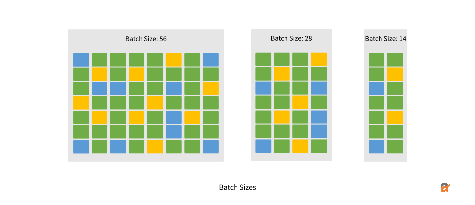

# Introduction to Deep Learning
**Fundamentals, Optimization, and Training**

<div style="font-size: 1.1em; margin-top: 20px;">

👨🏻‍🏫 Moreno La Quatra
🎓 Kore University of Enna

</div>

---

## Why Deep Learning for Speech and Vision?

<div class="definition">

### Traditional Approaches

**Manual feature engineering**:
- Computer Vision: Hand-crafted filters (edges, corners, SIFT, HOG)
- Speech: MFCCs, spectrograms, formants

**Limitations**:
- Requires extensive domain expertise
- Features may not be optimal for the task
- Difficult to adapt to new domains
- Limited capacity to capture complex patterns

</div>

---

<div class="image-container">


<p class="image-caption">Example of hand-crafted features: HOG (Histogram of Oriented Gradients) for object detection</p>

</div>

---

## The Deep Learning Revolution

<div class="example">

### Automatic Feature Learning

Instead of designing features, design the **architecture**:

**Lower layers** → Simple patterns (edges, basic sounds)
**Middle layers** → Complex patterns (shapes, phonemes)
**Higher layers** → Abstract concepts (objects, words)

The network learns the best representations from data!

</div>

---

<div class="image-container">


<p class="image-caption">Convolutional Neural Networks (CNNs) learn hierarchical features automatically from raw images</p>

</div>

---

## From Biological to Artificial

<div class="note">

Biological neurons:
- Receive signals from dendrites
- Process in cell body
- Send output through axon

**Artificial neurons** mimic this:
- Receive inputs (with weights)
- Sum and apply activation
- Send output to next layer

But artificial neural networks are **not** simulations of the brain!

</div>

---

## What is a Neural Network?

<div class="definition">

### Basic Components

A neural network is composed of:
- **Input layer**: Receives raw data
- **Hidden layers**: Process and transform data
- **Output layer**: Produces predictions

Each layer contains **neurons** connected by **weights**.

</div>

---

## Simple Neural Network

<div class="image-container">


<p class="image-caption">Simple feedforward neural network with one hidden layer</p>

</div>

---

## Deep Neural Networks

<div class="image-container">


<p class="image-caption">Deep neural network with multiple (two) hidden layers enables hierarchical feature learning</p>

</div>

---

## Why "Deep" Matters?

<div class="grid-2">

<div class="definition">

### Shallow Network

Must learn complex patterns in one step:
- Needs many neurons
- Requires many parameters
- Harder to train

</div>

<div class="definition">

### Deep Network

Breaks down complexity:
- Layer 1: Simple features
- Layer 2: Combinations
- Layer 3: Complex patterns
- More efficient!

</div>

</div>

---

## Concrete Example: Face Detection

<div class="example">

### Hierarchical Processing

**Layer 1**: Detect edges (horizontal, vertical, diagonal)

**Layer 2**: Combine edges into shapes (circles, rectangles)

**Layer 3**: Combine shapes into features (eyes, nose, mouth)

**Layer 4**: Combine features into faces

Each layer builds on the previous one!

</div>

---

## How Many Parameters?

<div class="definition">

### Parameter Count

For a fully-connected network with layers of size $n_1, n_2, ..., n_l$:

$$

\text{\# connections} = \sum_{i=1}^{l-1} n_i \times n_{i+1}

$$

**Example**: Network with 3-4-2 neurons
$$3 \times 4 + 4 \times 2 = 20 \text{ parameters}$$

</div>

---

## Supervised Learning

<div class="definition">

### Learning Paradigm

Training data consists of **input-output pairs**:

$$\mathcal{D} = \{(\mathbf{x}_1, \mathbf{y}_1), (\mathbf{x}_2, \mathbf{y}_2), \dots, (\mathbf{x}_N, \mathbf{y}_N)\}$$

**Goal**: Learn function $f$ that maps inputs to outputs

$$\mathbf{y} = f(\mathbf{x})$$

In deep learning, $f$ is a neural network!

</div>

---

## Loss Function

<div class="definition">

### Measuring Error

The **loss function** measures prediction error:

$$\mathcal{L}(\mathbf{y}, \mathbf{\hat{y}}) = \mathcal{L}(f(\mathbf{x}), \mathbf{y})$$

**Common loss functions**:
- **Mean Squared Error**: $\mathcal{L} = \frac{1}{N} \sum_{i=1}^N (\mathbf{y}_i - \mathbf{\hat{y}}_i)^2$ (regression)
- **Cross-Entropy**: $\mathcal{L} = - \sum_{i=1}^N \mathbf{y}_i \log(\mathbf{\hat{y}}_i)$ (classification)

</div>

---

## Neural Network Components

<div class="definition">

### Building Blocks

1. **Linear transformation**: $\mathbf{z} = W\mathbf{x} + \mathbf{b}$

2. **Non-linear activation**: $\mathbf{y} = g(\mathbf{z})$

**Why activation functions?**
Without non-linearity, multiple layers = single layer!
Non-linearity enables learning complex patterns.

</div>

---

## Common Activation Functions

<div class="image-container">


<p class="image-caption">Common activation functions: Sigmoid, Tanh, ReLU, Leaky ReLU</p>

</div>

---

## Activation Functions: Properties

<div class="definition">

### Key Properties

- **Sigmoid**: $\sigma(x) = \frac{1}{1 + e^{-x}}$ - Outputs in (0,1), but can saturate
- **Tanh**: $\tanh(x)$ - Outputs in (-1,1), zero-centered
- **ReLU**: $\max(0, x)$ - Most popular, fast, but can "die"
- **Leaky ReLU**: $\max(0.01x, x)$ - Fixes dying ReLU problem

</div>

---

## Optimization: Gradient Descent

<div class="definition">

### Finding Optimal Weights

Update weights to minimize loss:

$$w_i = w_i - \alpha \frac{\partial \mathcal{L}}{\partial w_i}$$

where:
- $\alpha$ is the **learning rate**
- $\frac{\partial \mathcal{L}}{\partial w_i}$ is the **gradient**

Move in the direction that reduces the loss!

</div>

---

## Backpropagation

<div class="definition">

### Computing Gradients

**Backpropagation** efficiently computes gradients using the chain rule:

1. **Forward pass**: Compute outputs layer by layer
2. **Compute loss**: Compare predictions to targets
3. **Backward pass**: Propagate gradients back through layers
4. **Update weights**: Apply gradient descent

</div>

---

## Training Process

<div class="image-container">


<p class="image-caption">Complete training process: forward propagation, loss computation, backpropagation, weight update</p>

</div>

---

## Mini-Batch Gradient Descent

<div class="example">

### Efficient Training

Instead of one example at a time, use **batches**:

- Compute gradients on batch of examples
- Average gradients
- Update weights once per batch

**Benefits**: Faster, more stable, better GPU utilization

</div>

---

## Training with Mini-Batches

<div class="image-container">


<p class="image-caption">Training with mini-batches. One complete pass through data = one epoch</p>

</div>

---

## Overfitting

<div class="important">

### The Core Challenge

**Overfitting** = Model learns training data too well, including noise

**Signs of overfitting**:
- Training loss ↓, validation loss ↑
- High training accuracy, poor test accuracy
- Model memorizes instead of generalizes

</div>

---

## Regularization: L1 and L2

<div class="definition">

### Weight Penalties

Add penalty term to loss function:

**L2 Regularization** (weight decay):
$$\mathcal{L}_{total} = \mathcal{L} + \lambda \sum_i w_i^2$$

**L1 Regularization**:
$$\mathcal{L}_{total} = \mathcal{L} + \lambda \sum_i |w_i|$$

Encourages smaller weights, prevents overfitting!

</div>

---

## Dropout

<div class="example">

### Random Neuron Removal

During training, randomly drop neurons with probability $p$:

```python
x = nn.Dropout(p=0.5)(x)  # Drop 50% of neurons
```

**Effect**: Forces network to learn redundant representations

**Important**: Disable during evaluation!
```python
model.eval()  # Automatically disables dropout
```

</div>

---

## Early Stopping

<div class="definition">

### Stop Before Overfitting

Monitor validation performance during training:
- Stop when validation loss stops improving
- Even if training loss still decreasing!

Simple but very effective technique.

</div>

---

## Batch Normalization

<div class="definition">

### Normalize Layer Inputs

For each mini-batch, normalize activations:

$$\hat{x}_i = \frac{x_i - \mu_B}{\sqrt{\sigma_B^2 + \epsilon}}$$

**Benefits**:
- Faster training (higher learning rates possible)
- Reduces sensitivity to initialization
- Acts as regularization
- Stabilizes training

</div>

---

## Batch Normalization: Usage

<div class="example">

### PyTorch Implementation

```python
class SimpleNet(nn.Module):
    def __init__(self):
        super().__init__()
        self.fc1 = nn.Linear(784, 256)
        self.bn1 = nn.BatchNorm1d(256)  # Add batch norm
        self.relu = nn.ReLU()
        self.fc2 = nn.Linear(256, 10)
    
    def forward(self, x):
        x = self.fc1(x)
        x = self.bn1(x)  # Normalize before activation
        x = self.relu(x)
        x = self.fc2(x)
        return x
```

</div>

---

## Batch Normalization: Warning

<div class="important">

### Training vs Evaluation Mode

Batch normalization behaves differently:
- **Training**: Uses batch statistics
- **Evaluation**: Uses running averages

Always remember:
```python
model.train()  # For training
model.eval()   # For evaluation/testing
```

</div>

---

## Data Splitting

<div class="definition">

### Three Sets Required

- **Training set**: Train the model
- **Validation set**: Tune hyperparameters, select best model
- **Test set**: Final evaluation (use only once!)

**Never** use test set for model selection!

</div>

---

## Data Splitting Visualization

<div class="image-container">


<p class="image-caption">Proper data splitting into training, validation, and test sets</p>

</div>

---

## Evaluation Metrics: Classification

<div class="definition">

### Common Metrics

**Accuracy**: 

$$\frac{\text{correct predictions}}{\text{total predictions}}$$

**Precision**: 

$$\frac{\text{true positives}}{\text{true positives} + \text{false positives}}$$

</div>

---

## Evaluation Metrics: Classification 

<div class="definition">

**Recall**: 

$$\frac{\text{true positives}}{\text{true positives} + \text{false negatives}}$$

**F1-Score**: 

$$2 \times \frac{\text{precision} \times \text{recall}}{\text{precision} + \text{recall}}$$

</div>

---

## Evaluation Metrics: Regression

<div class="definition">

**Mean Squared Error (MSE)**:
$$\text{MSE} = \frac{1}{N} \sum_{i=1}^N (\mathbf{y}_i - \mathbf{\hat{y}}_i)^2$$

**Mean Absolute Error (MAE)**:
$$\text{MAE} = \frac{1}{N} \sum_{i=1}^N |\mathbf{y}_i - \mathbf{\hat{y}}_i|$$

**Root Mean Squared Error (RMSE)**:
$$\text{RMSE} = \sqrt{\text{MSE}}$$

</div>

---

## Computational Considerations (GPU vs CPU)

<div class="grid-2">

<div class="definition">

**GPU advantages**:
- 10-100x faster for deep learning
- Thousands of parallel cores
- Optimized for matrix operations

**Memory constraints**:
- Model parameters
- Activations (depends on batch size)
- Gradients
- Optimizer state

</div>

<div class="note">

### Rule of Thumb

Total GPU memory ≈ 4 × model size × batch size

Example: 100M parameter model with batch size 32 needs ~12-16GB GPU memory

</div>

</div>

---

## Batch size visualization

<div class="image-container">



</div>

---

## Batch Size Considerations

<div class="grid-2">

<div class="example">

### Larger Batch Sizes

**Pros**:
- Faster training
- Better GPU utilization
- More stable gradients

**Cons**:
- More memory required
- May hurt generalization

</div>

<div class="example">

### Smaller Batch Sizes

**Pros**:
- Less memory required
- May generalize better
- Noisier gradients (can escape local minima)

**Cons**:
- Slower training
- Less stable

</div>

</div>

---

## Training Time Estimation

<div class="example">

### Calculate Before Training

**Formula**:
$$\text{time} = \text{time per batch} \times \text{batches per epoch} \times \text{epochs}$$

**Example**: 50,000 samples, batch size 32, 100 epochs
- Batches per epoch: 50,000 / 32 = 1,563
- Time per batch: 0.1 seconds
- Total time: 1,563 × 0.1 × 100 = **4.3 hours**

Always test a few iterations first!

</div>

---

## Key Takeaways

<div class="resources">

1. **Deep learning** learns hierarchical representations through multiple layers
2. **Supervised learning** minimizes loss using gradient descent and backpropagation
3. **Regularization** (dropout, weight decay, batch norm) prevents overfitting
4. **Proper data splitting** (train/val/test) is crucial for honest evaluation
5. **Computational resources** (GPU memory, batch size) must be carefully managed

</div>

---

# Thank You!

[Moreno La Quatra](https://mlaquatra.me)
[moreno.laquatra@unikore.it](mailto:moreno.laquatra@unikore.it)

🙋🏻‍♂️ Questions or Comments?