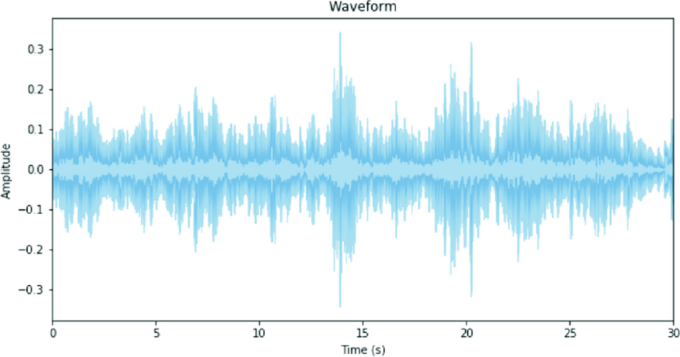

# Module 2: Convolutional Neural Networks
**Deep Learning for Computer Vision**

<div style="font-size: 1.1em; margin-top: 20px;">

👨🏻‍🏫 Moreno La Quatra
🎓 Kore University of Enna

</div>

---

## Images as Data

<div class="definition">

### Properties of Image Data

**Structure**: Images are grids of pixels

**Dimensions**: 
- Grayscale: Height × Width
- Color (RGB): Height × Width × 3

**Size considerations**:
- 224×224×3 image = 150,528 values
- High dimensional but highly structured!

</div>

---

## Problem with Fully Connected Networks

<div class="important">

### Why FC Networks Fail for Images

Consider a 224×224×3 color image (150,528 values):

**First hidden layer with 4,096 neurons**:
$$150,528 \times 4,096 = \mathbf{616\text{ million parameters}}$$

**Problems**:
- Computationally expensive
- Requires enormous training data
- Ignores spatial structure
- Very prone to overfitting

</div>

---

<div class="image-container">


<p class="image-caption">Fully connected networks ignore spatial structure and have too many parameters</p>

</div>

---

## Convolutional Neural Networks

<div class="definition">

### Key Insights

1. **Local connectivity**: Each neuron looks at small region
2. **Weight sharing**: Same weights used across image
3. **Spatial hierarchy**: Build complex features from simple ones

**Result**: Far fewer parameters, leverages image structure!

</div>

---

<div class="image-container">


<p class="image-caption">Convolutional layers exploit local patterns and share weights across spatial locations</p>

</div>

---

## CNN Architecture Overview

<div class="image-container">


<p class="image-caption">Typical CNN architecture: convolution layers extract features, pooling reduces dimensions, fully connected layers classify</p>

</div>

---

## Convolution Operation

<div class="definition">

### What is Convolution?

Slide a **filter (kernel)** across the image:

$$S(i, j) = \sum_m \sum_n I(i+m, j+n) \cdot K(m, n)$$

where:
- $I$ is the input image
- $K$ is the kernel/filter
- $S$ is the output (feature map)

The filter learns to detect specific patterns!

</div>

---

## Convolution: Visual Example

<div class="image-container">


</div>

---

## Convolution: Visual Example

<div class="image-container">


$$ 1\times 1 + 0\times 2 + 1\times 5 + 6 \times 0 = 1 + 0 + 5 + 0 = 6 $$

</div>

---

## Convolution: Visual Example

<div class="image-container">


$$ 2\times 1 + 3\times 0 + 6\times 1 + 7 \times 0 = 2 + 0 + 6 + 0 = 8 $$

</div>

---

## Convolution: Visual Example

<div class="image-container">


</div>

---

## Edge Detection Example

<div class="example">

### Simple Vertical Edge Detector

**Kernel in our example**:
```
[[1, 0],
 [1, 0]]
```

Detects vertical edges (dark → bright transition).

In CNNs, we do not "set" filters, we initialize randomly and **learn** them during training (with backpropagation)!

</div>

---

## Multiple Filters

<div class="definition">

### Multiple Feature Maps

Each convolutional layer has **multiple filters**:
- Each filter detects different patterns
- Produces multiple feature maps (depth dimension)

**Example**: 32 filters of size 3×3
- Input: 28×28×1
- Output: 26×26×32 (32 feature maps)

</div>

---

<div class="image-container">


<p class="image-caption">Multiple filters produce multiple feature maps, capturing different patterns</p>

</div>

---

## Convolution Parameters

<div class="definition">

### Important Hyperparameters

**Filter size**: Usually 3×3 or 5×5 (small receptive fields)

**Stride**: How much to move filter (usually 1 or 2)

**Padding**: Add borders to preserve spatial dimensions
- "valid": No padding (output smaller)
- "same": Zero padding (output same size)

**Number of filters**: Depth of output volume

</div>

---

## Convolution with Padding

<div class="image-container">


<p class="image-caption">Padding adds zeros around borders to preserve spatial dimensions</p>

</div>

---

## Convolution with Stride

<div class="image-container">


<p class="image-caption">Stride > 1 skips positions, reducing output size</p>

</div>

---

## Convolution with Stride

<div class="image-container">


<p class="image-caption">Stride > 1 skips positions, reducing output size</p>

</div>

---

## Convolution with Stride

<div class="image-container">


<p class="image-caption">Stride > 1 skips positions, reducing output size</p>

</div>

---

## Output Size Calculation

<div class="definition">

### Formula

Given input size $W$, filter size $F$, padding $P$, stride $S$:

$$W_{out} = \frac{W - F + 2P}{S} + 1$$

**Example**: $W=32, F=5, P=2, S=1$:
$$W_{out} = \frac{32 - 5 + 2(2)}{1} + 1 = 32$$

Same size output with appropriate padding!

</div>

---

## Pooling Layers

<div class="definition">

### Downsampling

**Purpose**: Reduce spatial dimensions while keeping important information

**Common types**:
- **Max pooling**: Take maximum value in region
- **Average pooling**: Take average value in region

**Typical**: 2×2 pooling with stride 2 → halves dimensions

</div>

---

## Max Pooling Example

<div class="example">

### 2×2 Max Pooling

Input (4×4):
```
[[1, 3, 2, 4],
 [5, 6, 1, 2],
 [7, 2, 9, 1],
 [3, 4, 2, 5]]
```

Output (2×2):
```
[[6, 4],
 [7, 9]]
```

Takes maximum from each 2×2 region!

</div>

---

## Pooling Visualization

<div class="image-container">


<p class="image-caption">Max pooling with 2×2 window and stride 2</p>

</div>

---

## Why Pooling?

<div class="grid-2">

<div class="definition">

### Benefits

- Reduces computational cost
- Makes features more robust to small translations
- Reduces overfitting
- Increases receptive field

</div>

<div class="note">

### Modern Trend

Many modern architectures replace pooling with:
- Strided convolutions
- Global average pooling
- Skip connections

</div>

</div>

---

## LeNet-5 Example

<div class="image-container">


<p class="image-caption">LeNet-5: One of the first successful CNNs for digit recognition</p>

</div>

---

## AlexNet (2012)

<div class="definition">

### The Breakthrough

**Key innovations**:
- Much deeper (8 layers)
- Used ReLU activation
- Dropout for regularization
- Data augmentation
- Trained on GPUs

**Result**: Won ImageNet 2012 with 15.3% error (vs 26.2% previous best)

</div>

---

## AlexNet Architecture

<div class="image-container">


<p class="image-caption">AlexNet architecture: 5 convolutional layers followed by 3 fully connected layers</p>

</div>

---

## VGGNet (2014)

<div class="definition">

### Very Deep Networks

**Key idea**: Use only 3×3 convolutions, go deeper

**VGG-16**: 16 layers
**VGG-19**: 19 layers

**Advantages**:
- Simple, uniform architecture
- Good performance
- Learned features transfer well

**Disadvantage**: Many parameters (~138M)

</div>

---

## VGGNet Architecture

<div class="image-container">


<p class="image-caption">VGGNet uses multiple 3×3 convolutions and doubles feature maps after each pooling</p>

</div>

---

## The Depth Problem

<div class="important">

### Vanishing/Exploding Gradients

As networks get deeper:
- Gradients can vanish (→ 0)
- Or explode (→ ∞)
- Training becomes unstable
- Performance degrades!

**Solution needed**: How to train very deep networks?

</div>

---

## ResNet (2015)

<div class="definition">

### Residual Learning

**Key innovation**: Skip connections (residual connections)

Instead of learning $H(x)$, learn residual $F(x) = H(x) - x$

$$H(x) = F(x) + x$$

**Intuition**: Easier to learn small adjustments than full transformation

</div>

Curiosity: [ResNet paper](https://arxiv.org/abs/1512.03385) is the most cited deep learning paper ever!

---

<div class="image-container">


<p class="image-caption">Residual block with skip connection. The identity shortcut enables training of very deep networks</p>

</div>

---

## ResNet Architecture

<div class="example">

### Configurations

**ResNet-18, ResNet-34, ResNet-50, ResNet-101, ResNet-152**: the `-XX` indicates number of layers.

**ResNet-152**: 152 layers, won ImageNet 2015

**Impact**: 
- Enabled training of very deep networks (1000+ layers!)
- Skip connections now used in most architectures (even in modern transformers)

</div>

---

## DenseNet (2017)

<div class="definition">

### Dense Connections

**Idea**: Each layer connected to all previous layers

**Benefits**:
- Alleviates vanishing gradients
- Encourages feature reuse
- Reduces parameters

**Trade-off**: High memory consumption

</div>

---

## EfficientNet (2019)

<div class="definition">

### Compound Scaling

**Problem**: How to scale up CNNs? Depth? Width? Resolution?

**Solution**: Scale all three dimensions together:
- **Depth**: Number of layers
- **Width**: Number of channels
- **Resolution**: Input image size

**Result**: Better accuracy with fewer parameters

</div>

---

## CNN Implementation in PyTorch

<div class="example">

`nn.Conv2d(in_channels, out_channels, kernel_size, stride=1, padding=0)`

```python
import torch.nn as nn

class SimpleCNN(nn.Module):
    def __init__(self, num_classes=10):
        super().__init__()
        self.features = nn.Sequential(
            nn.Conv2d(3, 32, kernel_size=3, padding=1),
            nn.ReLU(),
            nn.MaxPool2d(2, 2),
            nn.Conv2d(32, 64, kernel_size=3, padding=1),
            nn.ReLU(),
            nn.MaxPool2d(2, 2),
        )
        self.classifier = nn.Sequential(
            nn.Linear(64 * 8 * 8, 512),
            nn.ReLU(),
            nn.Dropout(0.5),
            nn.Linear(512, num_classes)
        )
```

</div>

---

## CNN Forward Pass

<div class="example">

### Complete Model

```python
    def forward(self, x):
        # x: batch_size × 3 × 32 × 32
        x = self.features(x)  # → batch_size × 64 × 8 × 8
        x = x.view(x.size(0), -1)  # Flatten
        x = self.classifier(x)  # → batch_size × 10
        return x

# Usage
model = SimpleCNN(num_classes=10)
input_tensor = torch.randn(16, 3, 32, 32)  # Batch of 16
output = model(input_tensor)  # torch.Size([16, 10])
```

</div>

---

## Transfer Learning

<div class="definition">

**Problem**: Training from scratch requires:
- Large datasets (millions of images)
- Long training time (days/weeks)
- Significant computational resources

**Solution**: Use pre-trained models!
- Start with weights learned on large dataset (ImageNet)
- Adapt to your specific task
- Much faster, requires less data

</div>

<br>

NB: Transfer learning, today, is a standard practice in CV and many other domains!

---

## Why Transfer Learning Works

<div class="example">

### Feature Hierarchy

**Early layers** (universal):
- Edges, corners, colors
- Useful for all vision tasks

**Middle layers** (less universal):
- Textures, patterns, shapes

**Late layers** (task-specific):
- Object parts, full objects

**Insight**: Early features transfer well across domains!

</div>

---

## Transfer Learning Strategies

<div class="grid-2">

<div class="definition">

### Strategy 1: Feature Extractor

**Freeze** all pre-trained layers
**Train** only new classifier

Use when:
- Small dataset
- Similar to pre-training data

</div>

<div class="definition">

### Strategy 2: Fine-tuning

**Freeze** early layers
**Fine-tune** later layers
**Train** new classifier

Use when:
- Medium dataset
- Somewhat different domain

</div>

</div>

---

## Transfer Learning Strategies

<div class="definition">

### Strategy 3: Full Fine-tuning (end-to-end)

**Fine-tune** all layers with small learning rate
**Train** new classifier

Use when:
- Large dataset
- Very different domain
- Or very different task

**Tip**: Use smaller learning rate for pre-trained layers!

</div>

---

## Transfer Learning: Feature Extractor

<div class="example">

### Code Example

```python
import torchvision.models as models

# Load pre-trained ResNet
model = models.resnet18(pretrained=True)

# Freeze all parameters
for param in model.parameters():
    param.requires_grad = False

# Replace final layer
num_features = model.fc.in_features
model.fc = nn.Linear(num_features, num_classes)

# Only the new layer will be trained!
```

</div>

---

## Transfer Learning: Fine-tuning

<div class="example">

### Code Example

```python
# Load pre-trained model
model = models.resnet18(pretrained=True)

# Freeze early layers
for name, param in model.named_parameters():
    if "layer4" not in name and "fc" not in name:
        param.requires_grad = False

# Replace classifier
model.fc = nn.Linear(model.fc.in_features, num_classes)

# Define optimizer with different learning rates
optimizer = torch.optim.Adam([
    {'params': model.layer4.parameters(), 'lr': 1e-4},
    {'params': model.fc.parameters(), 'lr': 1e-3}
])
```

</div>

---

## Pre-trained Models in PyTorch

<div class="example">

### torchvision.models

```python
import torchvision.models as models

# Available pre-trained models
resnet18 = models.resnet18(pretrained=True)
resnet50 = models.resnet50(pretrained=True)
vgg16 = models.vgg16(pretrained=True)
densenet121 = models.densenet121(pretrained=True)
efficientnet_b0 = models.efficientnet_b0(pretrained=True)

# All trained on ImageNet (1000 classes)
# Input: 224×224×3 RGB images
# Normalized with ImageNet mean/std
```

</div>

---

## Data Augmentation

<div class="definition">

### Artificially Increase Dataset

Apply random transformations to training images:
- **Geometric**: flips, rotations, crops, scaling
- **Color**: brightness, contrast, saturation, hue
- **Noise**: gaussian noise, blur

**Goal**: Model learns to be invariant to these transformations

**Critical**: Only apply to training data, not validation/test!

</div>

---

## Data Augmentation Examples

<div class="image-container">


<p class="image-caption">Common data augmentation techniques: horizontal flip, rotation, crop, color jitter</p>

</div>

---

## Data Augmentation in PyTorch

<div class="example">

### torchvision.transforms

```python
from torchvision import transforms

train_transform = transforms.Compose([
    transforms.RandomResizedCrop(224),
    transforms.RandomHorizontalFlip(),
    transforms.RandomRotation(15),
    transforms.ColorJitter(brightness=0.2, 
                          contrast=0.2, 
                          saturation=0.2),
    transforms.ToTensor(),
    transforms.Normalize(mean=[0.485, 0.456, 0.406],
                        std=[0.229, 0.224, 0.225])
])
```

</div>

---

## Data Augmentation: Validation Set

<div class="example">

### No Augmentation for Validation

```python
val_transform = transforms.Compose([
    transforms.Resize(256),
    transforms.CenterCrop(224),
    transforms.ToTensor(),
    transforms.Normalize(mean=[0.485, 0.456, 0.406],
                        std=[0.229, 0.224, 0.225])
])

# Apply to datasets
train_dataset = ImageFolder('train/', transform=train_transform)
val_dataset = ImageFolder('val/', transform=val_transform)
```

</div>

---

## CNNs for Audio

<div class="definition">

### From Speech to Image

Audio is 1D signal, but we can convert to 2D:

**Spectrogram**: Time-frequency representation
- X-axis: Time
- Y-axis: Frequency
- Color: Amplitude

Can now apply CNNs designed for images!

</div>

---

## Waveform Audio Representations
<div class="image-container">



<p class="image-caption">Waveform representation of audio signal</p>

</div>

---

## Spectrograms

<div class="image-container">


<p class="image-caption">Spectrogram representation of audio signal</p>

</div>

---

## Mel-Spectrograms

<div class="definition">

### Human-Inspired Representation

**Mel scale**: Mimics human perception of pitch

**Mel-spectrogram**: 
- Logarithmically spaced frequency bins
- Better for speech/music tasks
- Standard input for audio CNNs

**Result**: CNNs can learn from audio like they learn from images!

</div>

---

## Convolution on 1D Signals

<div class="definition">

### 1D Convolution

**1D Convolution**: Slide 1D filter over time axis
$$S(t) = \sum_m I(t+m) \cdot K(m)$$

**Use case**: Directly on raw audio waveforms
**Advantage**: Learns temporal patterns directly

NB: This is usually used as "feature extractor" before feeding to higher-level models (RNNs, Transformers)

---

## CNNs for Audio: Example

<div class="image-container">


<p class="image-caption">1D convolution sliding over audio waveform</p>

</div>

---

## CNNs for Audio: Example

<div class="image-container">


<p class="image-caption">1D convolution with stride > 1 reduces temporal resolution</p>

</div>

---

## CNNs for Audio: Example

<div class="image-container">


<p class="image-caption">1D convolution with larger stride further reduces temporal resolution</p>

</div>

---

## CNNs for Audio: Example

<div class="image-container">


<p class="image-caption">Multiple filters extract different features from audio waveform</p>

</div>

---

## CNNs for Audio: Spectrogram Input

```python
class AudioCNN2D(nn.Module):
    def __init__(self, num_classes=10):
        super().__init__()
        self.features = nn.Sequential(
            nn.Conv2d(1, 32, kernel_size=(3,3), padding=1),
            nn.ReLU(),
            nn.MaxPool2d((2,2)),
            nn.Conv2d(32, 64, kernel_size=(3,3), padding=1),
            nn.ReLU(),
            nn.MaxPool2d((2,2)),
        )
        self.classifier = nn.Sequential(
            nn.Linear(64 * 32 * 32, 512),
            nn.ReLU(),
            nn.Dropout(0.5),
            nn.Linear(512, num_classes)
        )

    def forward(self, x):
        x = self.features(x)  # x: batch_size × 1 × H × W
        x = x.view(x.size(0), -1)  # Flatten
        x = self.classifier(x)
        return x
```

---

## CNNs for Audio: Spectrogram Input

```python
import torchaudio.transforms as T
mel_spectrogram = T.MelSpectrogram(
    sample_rate=16000,
    n_mels=128,
    n_fft=1024,
    hop_length=512
)

# Usage
waveform, sr = torchaudio.load('audio.wav')
mel_spec = mel_spectrogram(waveform)  # Shape: [1, 128, time_frames]
```

---

## CNNs for Audio: 1D Model

```python

class AudioCNN1D(nn.Module):
    def __init__(self, num_classes=10):
        super().__init__()
        self.cnn_features = nn.Sequential(
            nn.Conv1d(1, 32, kernel_size=3, padding=1), # -> (B, 32, T)
            nn.ReLU(), nn.MaxPool1d(4), # -> (B, 32, T/4)

            nn.Conv1d(32, 64, kernel_size=3, padding=1), # -> (B, 64, T/4)  
            nn.ReLU(), nn.AvgPool1d(4), # -> (B, 64, T/16)

            nn.AdaptiveAvgPool1d(1),  # -> (B, 64, 1)
        )
        self.classifier = nn.Sequential(
            nn.Linear(64, 128), nn.ReLU(),
            nn.Dropout(0.5), nn.Linear(128, num_classes),
        )

    def forward(self, x):
        x = self.cnn_features(x)  # x: batch_size × 1 × time_steps
        x = x.squeeze(-1)  # Remove last dim -> (B, 64)
        x = self.classifier(x)
        return x
```

---

## CNNs for Audio: 1D Model

```python
import torchaudio
# Usage
waveform, sr = torchaudio.load('audio.wav')  # Shape: [1, time_steps]
model = AudioCNN1D(num_classes=10)
output = model(waveform.unsqueeze(0))  # .unsqueeze to add batch dim
# output shape: [1, 10] -> class predictions (batch_size, num_classes)
```

---

## For your projects

<div class="note">

**Small dataset** (< 10K images):
- Transfer learning as feature extractor + data augmentation

**Medium dataset** (10K-100K):
- Fine-tune later layers + data augmentation

**Large dataset** (> 100K):
- Full fine-tuning or train from scratch

**Audio tasks**:
- Use mel-spectrograms + 2D CNNs or,
- Raw waveforms + 1D CNNs

</div>

---

# Thank You!

[Moreno La Quatra](https://mlaquatra.me)
[moreno.laquatra@unikore.it](mailto:moreno.laquatra@unikore.it)

🙋🏻‍♂️ Questions or Comments?
