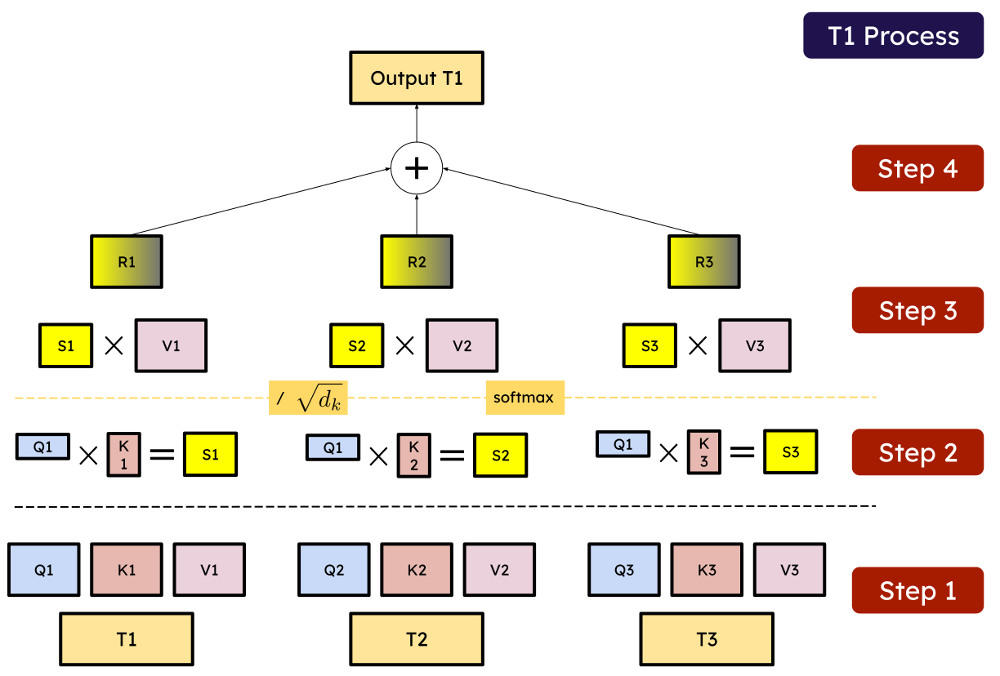
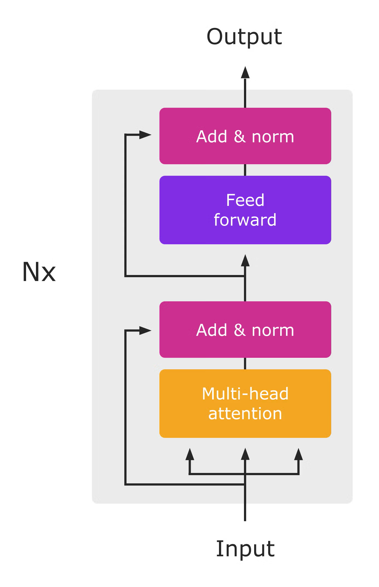
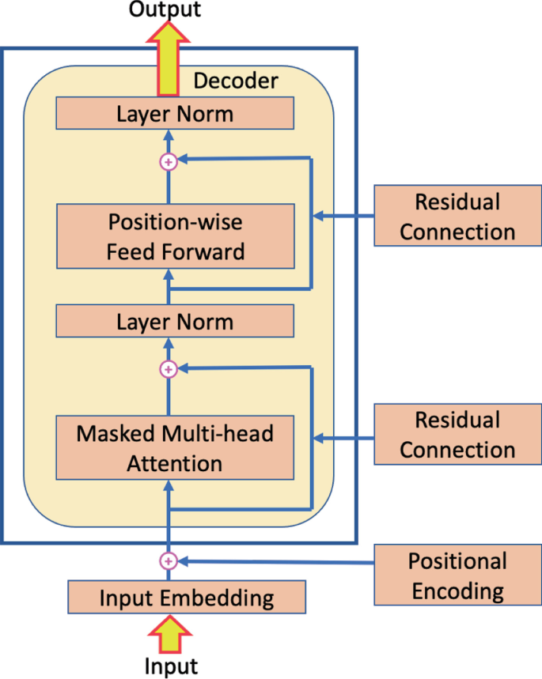

# Module 3: Transformers
**Attention Mechanisms and Modern Architectures**

<div style="font-size: 1.1em; margin-top: 20px;">

👨🏻‍🏫 Moreno La Quatra
🎓 Kore University of Enna

</div>

---

## The Sequential Processing Challenge

<div class="important">

### Problems with CNNs for Sequences

CNNs work great for images, but for sequences:

- **Fixed receptive field**: Can't easily capture long-range dependencies
- **No position awareness**: Convolution is translation-invariant
- **Inefficient for variable-length**: Need padding or cropping

For text, speech, video, we need models that can handle sequences!

</div>

---

<div class="image-container">


<p class="image-caption">CNNs have local receptive fields, RNNs process sequentially, Self-Attention connects all positions directly</p>

</div>

---

## Better Sequence Models

<div class="definition">

For effective sequence modeling:

- **Handle variable-length inputs**
- **Capture long-range dependencies**
- **Understand position/order**
- **Parallel processing** (for speed)

**The solution**: **Self-Attention Mechanism** that is the basis for the **Transformer Architecture**

</div>

---

## What is Attention?

<div class="definition">

### The Core Idea

**Attention**: Mechanism to focus on relevant parts of input

**Intuition**: When reading a sentence, we don't focus equally on all words
- Some words more important for understanding
- Relationships between distant words matter

**In neural networks**: Learn to weight different parts of input differently

</div>

---

<div class="image-container">


<p class="image-caption">Attention allows models to focus on relevant parts of the input</p>

</div>

---

## Attention: Real-World Analogy

<div class="example">

### Image Understanding Example

When describing an image of "A person playing guitar on stage":

**Understanding "playing"** requires attention to:
- The person's hand position
- The guitar
- The posture
- Less attention to background stage elements

**Attention mechanism** learns to focus on relevant parts automatically!

</div>

---

## Query, Key, Value

<div class="definition">

**Query (Q)**: What I'm looking for
**Key (K)**: What I have to offer
**Value (V)**: What I'll actually use

**Intuition**: 
- Query asks a question
- Keys indicate relevance
- Values provide actual information

**Mechanism**: Compare queries with keys, use to weight values

</div>

---

<div class="image-container">



</div>

---

## Let me explain by drawing!

<div style="height: 550px;"></div>

---

## Let me explain by drawing!

<div style="height: 550px;"></div>

---

## Let me explain by drawing!

<div style="height: 550px;"></div>

---

## Let me explain by drawing!

<div style="height: 550px;"></div>

---

<div class="image-container">


<p class="image-caption">

[ViT: Vision Transformer](https://arxiv.org/abs/2010.11929) applies self-attention to image patches

</p>

---

## Attention: Concrete Example

<div class="example">

Consider image patches: ["Sky", "Tree", "Ground"]

**Patch embeddings** (simplified, dimension=3):
- "Sky": $[1.0, 0.2, 0.1]$
- "Tree": $[0.1, 2.0, 0.3]$
- "Ground": $[0.2, 0.1, 1.5]$

**Goal**: Compute attention for "Tree" patch

</div>

---

## Step 1: Compute Similarities

<div class="example">

### Dot Product Scores

Query = "Tree" = $[0.1, 2.0, 0.3]$

**Similarity with "Sky"**: $0.1 \times 1.0 + 2.0 \times 0.2 + 0.3 \times 0.1 = 0.53$
**Similarity with "Tree"**: $0.1 \times 0.1 + 2.0 \times 2.0 + 0.3 \times 0.3 = 4.10$
**Similarity with "Ground"**: $0.1 \times 0.2 + 2.0 \times 0.1 + 0.3 \times 1.5 = 0.67$

Raw scores: $[0.53, 4.10, 0.67]$

</div>

---

## Step 2: Normalize with Softmax

<div class="example">

### Attention Weights

Apply softmax to get probabilities:

$$\text{softmax}([0.53, 4.10, 0.67]) = [0.09, 0.79, 0.12]$$

**Interpretation**:
- 9% attention to "Sky"
- 79% attention to itself ("Tree")
- 12% attention to "Ground"

Tree patch mainly attends to itself, with some context from surroundings!

</div>

---

## Step 3: Weighted Sum

<div class="example">

### Final Output

Compute weighted sum of values:

$$\text{output} = 0.09 \times [1.0, 0.2, 0.1] + 0.79 \times [0.1, 2.0, 0.3] + 0.12 \times [0.2, 0.1, 1.5]$$

$$= [0.19, 1.62, 0.44]$$

**Result**: Contextually-informed representation of "Tree" patch with surrounding context!

</div>

---

## Self-Attention Formula in matrix form (parallelization)

<div class="definition">

Given input sequence with Query $Q$, Key $K$, Value $V$:

$$\text{Attention}(Q, K, V) = \text{softmax}\left(\frac{QK^T}{\sqrt{d_k}}\right)V$$

where:
- $QK^T$: Compute all pairwise similarities
- $\sqrt{d_k}$: Scaling factor (dimension of keys)
- softmax: Normalize to get attention weights
- Multiply by $V$: Weighted sum

</div>

---

## Why Scale by $\sqrt{d_k}$?

<div class="note">

### Numerical Stability

**Problem**: For large dimensions, dot products grow large
- Softmax becomes saturated
- Gradients become very small

**Solution**: Scale by $\sqrt{d_k}$
- Keeps values in reasonable range
- Softmax remains responsive
- Better gradient flow

**Example**: $d_k = 64 \Rightarrow \text{scale by } \sqrt{64} = 8$

</div>

---

## Self-Attention Visualization

<div class="image-container">


</div>

---

## Multi-Head Attention

<div class="definition">

**Idea**: The original attention captures one type of relationship, but what if we want to capture multiple?

**Multi-head attention**:
1. Create $h$ different sets of $Q, K, V$ matrices
2. Compute attention for each "head" independently
3. Concatenate outputs
4. Apply final linear projection

**Benefit**: Capture different types of relationships simultaneously

</div>

---

## Multi-Head Attention: Why?

<div class="example">

In an image or audio, different heads might learn:

**Head 1**: Local patterns (textures, edges, phonemes)
**Head 2**: Spatial/temporal relationships (object parts, word boundaries)
**Head 3**: Long-range dependencies (scene context, sentence structure)
**Head 4**: Global context (overall composition, prosody)

Each head specializes in different patterns!

</div>

---

## Multi-Head Attention Formula

<div class="definition">

### Mathematical Formulation

$$\text{MultiHead}(Q, K, V) = \text{Concat}(\text{head}_1, ..., \text{head}_h)W^O$$

where each head is:

$$\text{head}_i = \text{Attention}(QW_i^Q, KW_i^K, VW_i^V)$$

**Parameters**: $W_i^Q, W_i^K, W_i^V$ for each head, $W^O$ for output projection

**Typical**: 8-16 heads in modern Transformers

</div>

---


<div class="image-container">


<p class="image-caption">Multi-head attention runs multiple attention operations in parallel</p>

</div>

---

## Positional Encoding

<div class="important">

Self-attention treats input as a set, not a sequence!

Swapping patch positions gives same output:
[patch_1, patch_2] ≈ [patch_2, patch_1]

**But order matters**!
- For images: Spatial position is crucial
- For audio: Temporal order defines meaning

**Solution**: Add positional information to embeddings

</div>

---

## Positional Encoding: Formula

<div class="definition">

### Sinusoidal Positional Encoding

$$PE_{(pos, 2i)} = \sin\left(\frac{pos}{10000^{2i/d}}\right)$$

$$PE_{(pos, 2i+1)} = \cos\left(\frac{pos}{10000^{2i/d}}\right)$$

where:
- $pos$: position in sequence
- $i$: dimension index
- $d$: model dimension

Different frequencies for different dimensions!

</div>

---

<div class="image-container">


<p class="image-caption">

Sinusoidal positional encoding adds unique position info to each token/frame/patch [link to the website](https://erdem.pl/2021/05/understanding-positional-encoding-in-transformers)

</p>

---

## Transformer Block

<div class="definition">

Each Transformer block contains:

1. **Multi-head self-attention**
2. **Add & Normalize** (residual connection + layer norm)
3. **Feed-forward network** (2 linear layers with activation)
4. **Add & Normalize** (residual connection + layer norm)

Stack multiple blocks to form complete Transformer!

</div>

---

## Transformer Encoder Block

<div class="image-container">


</div>

---

## Feed-Forward Network

<div class="definition">

### Position-wise FFN

Applied independently to each position:

$$\text{FFN}(x) = \max(0, xW_1 + b_1)W_2 + b_2$$

**Properties**:
- Same parameters for all positions
- Usually expands then contracts: $d_{model} \rightarrow 4 \times d_{model} \rightarrow d_{model}$
- Adds capacity to transform representations

</div>

---

## Layer Normalization

<div class="definition">

### Stabilizing Training

Normalize across features for each sample:

$$\text{LayerNorm}(x) = \gamma \frac{x - \mu}{\sigma + \epsilon} + \beta$$

where $\mu, \sigma$ are mean and std across features

**Benefits**:
- Stabilizes training of deep networks
- Enables higher learning rates
- Works better than batch norm for sequences

</div>

---

## Residual Connections

<div class="definition">

### Skip Connections

Instead of $x_{out} = F(x_{in})$, use:

$$x_{out} = x_{in} + F(x_{in})$$

**Benefits**:
- Easier to optimize (gradients flow directly)
- Allows very deep networks
- Identity function as fallback

Critical for training deep Transformers, do you remember **ResNets**?

</div>

---

## Complete Transformer Architecture

<div class="important">

What we've covered so far is the **Transformer Encoder**. This is a **discriminative** model that processes input data (text, images, audio) to produce representations for classification or regression tasks.

The full **Transformer** architecture also includes a **Decoder** component, which is used for **generative** tasks like language translation, image captioning, and speech synthesis.

The Encoder and Decoder have some (minor) differences in their structure and attention mechanisms.

---

## Transformer Architecture Overview

<div class="example">

The **Encoder** is used for image/text/audio understanding tasks:
1. Input data (image patches, text tokens, audio frames)
2. Pass through stack of Transformer encoder blocks
3. Output representations for classification/regression

</div>

---

<div class="image-container">



</div>

---

## Transformer Decoder

<div class="example">

The **Decoder** is used for generative tasks:
1. Input: Encoder output + previous generated tokens
2. Pass through stack of Transformer decoder blocks
3. Output: Next token probabilities for generation

NB: have you heard about **GPT** models? ChatGPT, Claude, Gemini, ... are all based on Transformer decoders!

---

<div class="image-container">



</div>

---

## Self-Attention vs Masked Self-Attention

<div class="definition">

Self-Attention (Encoder):
- Each position attends to all positions
- Bidirectional context
- Used for understanding input

Masked Self-Attention (Decoder):
- Each position attends only to previous positions (causal, we cannot predict future!)
- Enables autoregressive generation at inference (e.g., tokens appearing one after another)

---

<div class="image-container">


</div>

---

## Encoder vs Decoder

<div class="grid-2">

<div class="definition">

### Encoder

**Purpose**: Process input data

**Components**:
- Self-attention (bidirectional)
- Feed-forward network
- Stack of $N$ blocks

**Use**: ViT for images, audio classification

</div>

<div class="definition">

### Decoder

**Purpose**: Generate output sequence

**Components**:
- Masked self-attention (causal)
- Cross-attention to encoder
- Feed-forward network
- Stack of $N$ blocks

**Use**: Image captioning, speech synthesis

</div>

</div>

---

## Masked Self-Attention

<div class="definition">

### Causal Attention for Generation

**Problem**: During generation, can't look at future tokens!

**Solution**: Mask future positions in attention:

$$\text{mask}_{i,j} = \begin{cases} 0 & \text{if } i \geq j \\ -\infty & \text{if } i < j \end{cases}$$

**Effect**: Position $i$ can only attend to positions $\leq i$

**Use**: GPT, decoder in translation

</div>

---

## Encoder + Decoder = Transformer

<div class="definition">

The original Transformer architecture was neither just an encoder nor just a decoder, but a combination of both!

**Encoder**: Processes input sequence (e.g., source language)
**Decoder**: Generates output sequence (e.g., target language)

NB: It was originally designed for machine translation!

It introduced the concept of **cross-attention** between encoder and decoder:
- The encoder "reads and understands" the input
- The decoder "writes" the output while **paying attention** to the encoder's output

</div>

---

<div class="image-container">


<p class="image-caption">Full Transformer architecture with encoder and decoder components</p>
</div>

---

## Cross-Attention

<div class="definition">

### Attending to Encoder Output

In decoder blocks:

**Queries**: From decoder (what we're generating)
**Keys & Values**: From encoder (input we're conditioning on)

$$\text{CrossAttention}(Q_{decoder}, K_{encoder}, V_{encoder})$$

Allows decoder to "look at" relevant parts of input!

</div>

---

## Example, Image Captioning

<div class="example">


**Input**: Image patches → **Encoder**
**Output**: **Decoder** → Caption text

**Process**:
1. Encoder processes image patches
2. Decoder generates caption, one word at a time
3. Cross-attention links words to relevant image regions
4. Masked attention ensures causal generation

</div>

---

## Transformers Beyond Text

<div class="definition">

[**Vision Transformer (ViT)** (2020)](https://arxiv.org/abs/2010.11929): Images as patch sequences
- Pre-trained on ImageNet
- Fine-tuned for classification, detection, segmentation

[**Wav2Vec 2.0** (2020)](https://arxiv.org/abs/2006.11477): Self-supervised audio learning
- Pre-trained on raw audio waveforms
- Fine-tuned for speech recognition, classification

[**Whisper** (2022)](https://arxiv.org/abs/2212.04356): Encoder-decoder for speech
- Multilingual speech recognition and translation
- Robust to noise and accents
- Pre-trained on 680k hours of data

</div>

---

## Vision Transformers (ViT)

<div class="image-container">


</div>

---

## ViT: Key Components

<div class="definition">

1. **Patch Embedding**: Split image into fixed-size patches, flatten, linear projection
2. **Positional Encoding**: Add positional info to patch embeddings
3. **Transformer Encoder**: Stack of Transformer encoder blocks
4. **Classification Head**: Use `[CLS]` token representation for classification
5. **Pre-training + Fine-tuning**: Pre-train on large dataset, fine-tune on specific tasks

---

## Wav2Vec 2.0

<div class="image-container">


</div>

---

## Wav2Vec 2.0: Key Components

<div class="definition">

1. **Feature Encoder**: CNN layers to extract features from raw audio (and reduce dimensionality) - this creates "patches" in time
2. **Positional Encoding**: Add positional info to feature embeddings
3. **Transformer Encoder**: Stack of Transformer encoder blocks to model temporal dependencies
4. **Contrastive Loss**: Self-supervised learning by predicting masked time steps
5. **Fine-tuning**: Add linear layer for downstream tasks (ASR, classification)

</div>

---

## Whisper

<div class="image-container">


</div>

---

## Whisper: Key Components

<div class="definition">

1. **CNN Feature Extractor**: Initial CNN layers to extract features from mel-spectrograms (time-frequency patches)
2. **Positional Encoding**: Add positional info to feature embeddings
3. **Transformer Encoder-Decoder**: Stack of Transformer encoder and decoder blocks
4. **Multitask Learning**: Jointly trained for generating text (transcription, translation)
5. **Robustness**: Trained on diverse data for noise and accent robustness

---

## Hybrid Architectures

<div class="definition">

In vision and audio processing, CNNs are often used as initial feature extractors before Transformers.

**Idea**: Combine CNNs and Transformers

**Approaches**:
1. **CNN backbone** → patches from feature maps
2. **Convolutional stem** → learned patch embeddings
3. **CNN + Transformer** → local + global processing

**Examples**: CoAtNet, ConvNext, MaxViT

Often better than pure CNNs or pure Transformers!

</div>

---

## Computational Complexity

<div class="definition">

### Attention vs Convolution

**Self-attention**: $O(N^2 \cdot d)$
- Quadratic in sequence length $N$
- Problem for long sequences

**Convolution**: $O(N \cdot k \cdot d)$
- Linear in sequence length
- $k$ is kernel size

**Trade-off**: CNNs faster for long sequences, Transformers better for global context

</div>

---

## Transformer Implementation: Attention

<div class="example">

```python
import torch.nn as nn
import torch.nn.functional as F

class MultiHeadAttention(nn.Module):
    def __init__(self, d_model, num_heads):
        super().__init__()
        self.d_model = d_model
        self.num_heads = num_heads
        self.head_dim = d_model // num_heads
        
        self.qkv = nn.Linear(d_model, 3 * d_model)
        self.out = nn.Linear(d_model, d_model)
```

</div>

---

## Transformer Implementation: Forward

<div class="example">

### Attention Forward Pass

```python
    def forward(self, x):
        B, N, C = x.shape  # batch, seq_len, channels
        
        # Generate Q, K, V
        qkv = self.qkv(x).reshape(B, N, 3, self.num_heads, 
                                   self.head_dim)
        qkv = qkv.permute(2, 0, 3, 1, 4)
        q, k, v = qkv[0], qkv[1], qkv[2]
        
        # Attention
        attn = (q @ k.transpose(-2, -1)) / (self.head_dim ** 0.5)
        attn = F.softmax(attn, dim=-1)
        
        # Apply to values
        x = (attn @ v).transpose(1, 2).reshape(B, N, C)
        return self.out(x)
```

</div>

---

## Transformer Block Implementation

<div class="example">

### Complete Block

```python
class TransformerBlock(nn.Module):
    def __init__(self, d_model, num_heads, mlp_ratio=4):
        super().__init__()
        self.attn = MultiHeadAttention(d_model, num_heads)
        self.mlp = nn.Sequential(
            nn.Linear(d_model, d_model * mlp_ratio),
            nn.GELU(),
            nn.Linear(d_model * mlp_ratio, d_model)
        )
        self.norm1 = nn.LayerNorm(d_model)
        self.norm2 = nn.LayerNorm(d_model)
    
    def forward(self, x):
        x = x + self.attn(self.norm1(x))  # Attention + residual
        x = x + self.mlp(self.norm2(x))   # MLP + residual
        return x
```

</div>

---

## Using Pre-trained Transformers

<div class="example">

### HuggingFace Transformers

```python
from transformers import AutoModel, AutoTokenizer

# For text
model = AutoModel.from_pretrained("bert-base-uncased")
tokenizer = AutoTokenizer.from_pretrained("bert-base-uncased")

# For vision
from transformers import ViTModel
model = ViTModel.from_pretrained("google/vit-base-patch16-224")

# For audio
from transformers import Wav2Vec2Model
model = Wav2Vec2Model.from_pretrained("facebook/wav2vec2-base")
```

</div>

---

## Transfer Learning with Transformers

<div class="definition">

### Pre-training + Fine-tuning

**Pre-training**: Learn general representations on large dataset
- Language: Masked language modeling, next-token prediction
- Vision: Supervised (ImageNet) or self-supervised (MAE)
- Speech: Contrastive learning, masked prediction

**Fine-tuning**: Adapt to specific task
- Add task-specific head
- Fine-tune with small learning rate

</div>

---

## Attention Visualization

<div class="note">

The attention mechanism provides a tool for interpretability!

**Tools**:
- [Ferret](https://github.com/g8a9/ferret) is a library that benchmark different interpretability methods for transformers.
- [Captum](https://captum.ai/): is an open source, extensible library for model interpretability built on PyTorch.
- [inseq](https://inseq.org/en/latest/): is a library for interpreting sequence-to-sequence models, support various attribution methods.

**Insights**:
- Which inputs are most important?
- Does model learn expected patterns?

</div>

---

<div class="image-container">


<p class="image-caption">

source: [https://github.com/inseq-team/inseq](https://github.com/inseq-team/inseq)

</p>

---

## Transformers vs CNNs

<div class="grid-2">

<div class="definition">

### CNNs

**Pros**:
- Strong inductive biases
- Efficient for local patterns
- Work well with less data

**Cons**:
- Limited receptive field
- Less flexible

</div>

<div class="definition">

### Transformers

**Pros**:
- Global context from layer 1
- More flexible
- Better scaling

**Cons**:
- Need more data
- Computationally expensive
- No built-in locality

</div>

</div>

---

## The Transformer Revolution

<div class="important">

### Impact Across Domains

**NLP**: BERT, GPT, T5 → human-level language understanding

**Vision**: ViT, DEIT, Swin → competitive with CNNs

**Speech**: Wav2Vec 2.0, Whisper → robust ASR

**Multimodal**: CLIP, Flamingo → vision + language

Transformers have fundamentally changed deep learning!

</div>

---

## Optional: Connection to RNNs

<div class="note">

### Historical Context

Before Transformers, **Recurrent Neural Networks (RNNs)** were standard for sequences:
- LSTMs and GRUs addressed vanishing gradients
- Sequential processing (can't parallelize)
- Limited long-range dependencies

**Transformers** replaced RNNs by:
- Parallel processing via self-attention
- Direct connections between all positions
- Better at long-range dependencies

For understanding about RNNs, see jupyter book's optional section!

</div>

---

# Thank You!

[Moreno La Quatra](https://mlaquatra.me)
[moreno.laquatra@unikore.it](mailto:moreno.laquatra@unikore.it)

🙋🏻‍♂️ Questions or Comments?