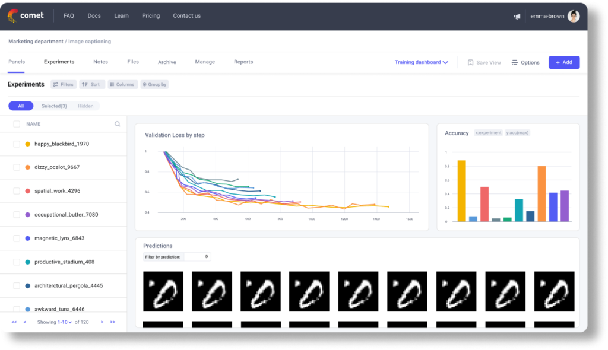

# Module 4: Practical Tools & Libraries
**PyTorch, HuggingFace, Debugging, and Monitoring**

<div style="font-size: 1.1em; margin-top: 20px;">

👨🏻‍🏫 Moreno La Quatra
🎓 Kore University of Enna

</div>

---

## Why PyTorch?

<div class="definition">

**Advantages**:
- Pythonic and intuitive API
- Dynamic computation graphs
- Strong research community
- Extensive ecosystem
- Production-ready (TorchServe, TorchScript)

**Used by**: Meta, Microsoft, OpenAI, and most research labs

</div>

---

## PyTorch Basics: Tensors

<div class="example">

Tensors are multi-dimensional arrays, that are used as the basic data structure in PyTorch, they can be operated on CPU, GPU or other accelerators.

```python
import torch

# Create tensors
x = torch.tensor([1.0, 2.0, 3.0])
y = torch.zeros(2, 3)
z = torch.randn(3, 4)  # Random normal

# Operations
a = x + 2.0
b = torch.matmul(y, z)
c = x.reshape(3, 1)

# Move to GPU
if torch.cuda.is_available():
    x = x.cuda()  # or x.to('cuda')
```

</div>

---

## Automatic Differentiation

<div class="example">

The `autograd` package automatically computes gradients for tensor operations. It keeps track of operations on tensors with `requires_grad=True`.

```python
# Enable gradient tracking
x = torch.tensor([2.0], requires_grad=True)

# Forward pass
y = x ** 2 + 3 * x + 1

# Backward pass (compute gradients)
y.backward()

# Access gradient
print(x.grad)  # dy/dx = 2*x + 3 = 7.0

# Important: zero gradients before next backward
x.grad.zero_()
```

</div>

---

## Building Models: nn.Module

<div class="example">

The main structure for building models in PyTorch is `nn.Module`. We define layers in `__init__` and the forward pass in `forward()`.

```python
import torch.nn as nn

class SimpleNet(nn.Module): # nn.Module is the base class
    def __init__(self, input_size, hidden_size, output_size):
        super().__init__()
        self.fc1 = nn.Linear(input_size, hidden_size)
        self.relu = nn.ReLU()
        self.fc2 = nn.Linear(hidden_size, output_size)
    
    def forward(self, x):
        x = self.fc1(x)
        x = self.relu(x)
        x = self.fc2(x)
        return x

model = SimpleNet(784, 256, 10)
```

</div>

---

## Training Loop Structure

<div class="example">

(1) take data -> (2) foward to the model -> (3) compute loss -> (4) backward -> (5) optimizer step --> repeat

```python
model.train()  # Set to training mode

for epoch in range(num_epochs):
    for batch_idx, (data, target) in enumerate(train_loader):
        # Move to GPU
        data, target = data.to(device), target.to(device)
        
        # Zero gradients
        optimizer.zero_grad()
        
        # Forward pass
        output = model(data)
        loss = criterion(output, target)
        
        # Backward pass
        loss.backward()
        
        # Update weights
        optimizer.step()
```

</div>

---

## Evaluation Mode

<div class="important">

There are two modes in PyTorch models: training and evaluation.

```python
# Training mode
model.train()
# - Enables dropout
# - BatchNorm uses batch statistics

# Evaluation mode
model.eval()
# - Disables dropout
# - BatchNorm uses running statistics

# Disable gradient computation for efficiency
with torch.no_grad():
    for data, target in val_loader:
        output = model(data)
        # ...
```

**Always** call `model.eval()` during validation/testing!

</div>

---

## Loss Functions

<div class="definition">

The loss function quantifies the difference between predictions and targets.

```python
# Classification
criterion = nn.CrossEntropyLoss()  # For multi-class
criterion = nn.BCEWithLogitsLoss()  # For binary

# Regression
criterion = nn.MSELoss()  # Mean squared error
criterion = nn.L1Loss()   # Mean absolute error

# Custom loss
class CustomLoss(nn.Module):
    def __init__(self):
        super().__init__()
    
    def forward(self, pred, target):
        return torch.mean((pred - target) ** 2)
```

</div>

---

## Optimizers

<div class="example">

They are used to update model weights based on computed gradients.

```python
# Adam (most common)
optimizer = torch.optim.Adam(model.parameters(), lr=1e-3)

# SGD with momentum
optimizer = torch.optim.SGD(model.parameters(), 
                           lr=0.01, momentum=0.9)

# AdamW (Adam with weight decay)
optimizer = torch.optim.AdamW(model.parameters(), 
                              lr=1e-3, weight_decay=0.01)

# Different learning rates for different parts
optimizer = torch.optim.Adam([
    {'params': model.encoder.parameters(), 'lr': 1e-4},
    {'params': model.decoder.parameters(), 'lr': 1e-3}
])
```

</div>

---

## Learning Rate Scheduling

<div class="example">

We can change the learning rate during training to improve convergence.

```python
from torch.optim.lr_scheduler import *

# Reduce on plateau
scheduler = ReduceLROnPlateau(optimizer, mode='min', 
                             factor=0.1, patience=10)

# Cosine annealing
scheduler = CosineAnnealingLR(optimizer, T_max=100)

# Step decay
scheduler = StepLR(optimizer, step_size=30, gamma=0.1)

# Usage in training loop
for epoch in range(num_epochs):
    train(...)
    val_loss = validate(...)
    scheduler.step(val_loss)  # For ReduceLROnPlateau
    # scheduler.step()  # For others
```

</div>

---

## Data Loading

<div class="example">

Data loading is handled by `Dataset` and `DataLoader` classes. `Dataset` defines how to access data, it needs to implement `__init__`, `__len__`, and `__getitem__` methods.

```python
from torch.utils.data import Dataset, DataLoader

class CustomDataset(Dataset):
    def __init__(self, data, labels):
        self.data = data
        self.labels = labels
    
    def __len__(self):
        return len(self.data)
    
    def __getitem__(self, idx):
        return self.data[idx], self.labels[idx]
```

</div>

---

## DataLoader Example

<div class="example">

The `DataLoader` handles batching, shuffling, and parallel loading.

```python
# Create DataLoader
train_loader = DataLoader(
    dataset=train_dataset,
    batch_size=32,
    shuffle=True,
    num_workers=4  # Parallel data loading
)
val_loader = DataLoader(
    dataset=val_dataset,
    batch_size=64,
    shuffle=False,
    num_workers=4
)
```
</div>

---

## Data Handling

1. **`Dataset`**: Defines how to access individual data points. It must implement:
   - `__init__`: Load data and (if needed) labels
   - `__len__`: Return dataset size
   - `__getitem__`: Return data point as required (e.g., tensor, tuple, dict...)
  
2. **`DataLoader`**: Wraps a `Dataset` to provide:
   - Batching: Groups data points into batches
   - Shuffling: Randomizes data order each epoch
   - Parallel loading: Uses multiple workers to load data faster

---

<div class="image-container">


</div>


---

## Model Checkpointing

<div class="definition">

**Why checkpoint?**
- Resume training after interruption
- Save best model based on validation
- Save every N epochs for safety
- Share models with others

**What to save?**
- Model weights (`state_dict`)
- Optimizer state
- Epoch number
- Best validation metric

</div>

---

## Checkpointing: Implementation

<div class="example">

```python
# Save checkpoint
def save_checkpoint(state, filename="checkpoint.pth"):
    torch.save(state, filename)

checkpoint = {
    'epoch': epoch,
    'model_state_dict': model.state_dict(),
    'optimizer_state_dict': optimizer.state_dict(),
    'loss': loss,
    'best_val_acc': best_val_acc
}
save_checkpoint(checkpoint, 'model_epoch_10.pth')

# Load checkpoint
checkpoint = torch.load('model_epoch_10.pth')
model.load_state_dict(checkpoint['model_state_dict'])
optimizer.load_state_dict(checkpoint['optimizer_state_dict'])
start_epoch = checkpoint['epoch'] + 1
```

</div>

---

## Best Model Saving

<div class="example">

```python
best_val_loss = float('inf')

for epoch in range(num_epochs):
    train_loss = train(...)
    val_loss = validate(...)
    
    # Save if best model so far
    if val_loss < best_val_loss:
        best_val_loss = val_loss
        checkpoint = {
            'epoch': epoch,
            'model_state_dict': model.state_dict(),
            'optimizer_state_dict': optimizer.state_dict(),
            'val_loss': val_loss
        }
        torch.save(checkpoint, 'best_model.pth')
        print(f'Saved best model at epoch {epoch}')
```

</div>

---

## HuggingFace Ecosystem (`transformers` and `datasets` libraries)

<div class="definition">

**What it provides**:
- Pre-trained models (1000s of models)
- Tokenizers for text
- Datasets library
- Trainers for easy training
- Model hub for sharing

**Domains**: NLP, Vision, Audio, Multimodal

```python
pip install transformers datasets
```

</div>

---

## HuggingFace: Using Pre-trained Models

<div class="example">

### Load and Use

```python
from transformers import AutoModel, AutoImageProcessor

# Load model and processor
model = AutoModel.from_pretrained("facebook/deit-base-distilled-patch16-224")
processor = AutoImageProcessor.from_pretrained(
    "facebook/deit-base-distilled-patch16-224"
)

# Process image
from PIL import Image
image = Image.open("cat.jpg")
inputs = processor(image, return_tensors="pt") # prepare inputs for model

# Forward pass
outputs = model(**inputs)
features = outputs.last_hidden_state
```

</div>

---

## HuggingFace: Fine-tuning

<div class="example">

```python
from transformers import (
    AutoModelForImageClassification,
    Trainer,
    TrainingArguments
)

# Load pre-trained model
model = AutoModelForImageClassification.from_pretrained(
    "facebook/deit-base-distilled-patch16-224", # vision model
    num_labels=num_classes, # this just add a final classification layer
)

# Define training arguments
training_args = TrainingArguments(
    output_dir="./results",
    per_device_train_batch_size=16,
    num_train_epochs=10,
    evaluation_strategy="epoch",
    save_strategy="epoch",
    load_best_model_at_end=True,
)
```

</div>

---

## HuggingFace: Trainer

<div class="example">

### Simplified Training

```python
# Create trainer
trainer = Trainer(
    model=model,
    args=training_args,
    train_dataset=train_dataset,
    eval_dataset=val_dataset,
    compute_metrics=compute_metrics
)

# Train!
trainer.train()
# Evaluate
metrics = trainer.evaluate()
# Predict
predictions = trainer.predict(test_dataset)
```

It is **highly recommended** to experiment with your own training loop for better control!
</div>

---

## Experiment Tracking with CometML

<div class="definition">

### Why Track Experiments?

**Problems without tracking**:
- Forget which hyperparameters worked
- Can't reproduce results
- No comparison between runs
- Lost when training crashes

**Solutions**: Experiment tracking tools
- CometML, Weights & Biases, TensorBoard, MLflow

</div>

---

<div class="image-container">



</div>

---

## CometML Setup

<div class="example">

### Getting Started

```python
from comet_ml import Experiment

# Create experiment
experiment = Experiment(
    api_key="YOUR_API_KEY",
    project_name="dl4sv-project",
    workspace="your-workspace"
)

# setting a specific name for the experiment
experiment.set_name("deep-learning-experiment-1")

# Log hyperparameters
experiment.log_parameters({
    "learning_rate": 1e-3,
    "batch_size": 32,
    "epochs": 100,
    "model": "resnet50"
})
```

</div>

---

## CometML: Logging Metrics

<div class="example">

### Track Training Progress

```python
for epoch in range(num_epochs):
    # Training
    train_loss, train_acc = train(...)
    experiment.log_metric("train_loss", train_loss, epoch=epoch)
    experiment.log_metric("train_acc", train_acc, epoch=epoch)
    
    # Validation
    val_loss, val_acc = validate(...)
    experiment.log_metric("val_loss", val_loss, epoch=epoch)
    experiment.log_metric("val_acc", val_acc, epoch=epoch)
    
    # Log learning rate
    lr = optimizer.param_groups[0]['lr']
    experiment.log_metric("learning_rate", lr, epoch=epoch)
```

</div>

---

## CometML: Logging Artifacts

<div class="example">

### Save Models and Images

```python
# Log model
experiment.log_model("best_model", "best_model.pth")

# Log images
experiment.log_image(image, name="sample_prediction", 
                    step=epoch)

# Log confusion matrix
experiment.log_confusion_matrix(y_true, y_pred,
                               labels=class_names)

# End experiment
experiment.end()
```

</div>

---

## Hyperparameter Tuning

<div class="definition">

### The Challenge

**Hyperparameters to tune**:
- Learning rate
- Batch size
- Network architecture (layers, units)
- Regularization (dropout, weight decay)
- Optimizer choice
- Learning rate schedule

**Problem**: Exponential search space!

</div>

---

## Tuning Strategies

<div class="grid-2">

<div class="definition">

### Manual Search

**Process**: Try values based on intuition

**Pros**: Quick, uses expertise
**Cons**: Unsystematic, biased

</div>

<div class="definition">

### Grid Search

**Process**: Try all combinations

**Pros**: Systematic, exhaustive
**Cons**: Exponentially expensive

</div>

</div>

---

## Tuning Strategies

<div class="grid-2">

<div class="definition">

### Random Search

**Process**: Sample randomly

**Pros**: More efficient than grid
**Cons**: May miss optimal region

</div>

<div class="definition">

### Bayesian Optimization

**Process**: Model objective, suggest next trial

**Pros**: Most sample-efficient
**Cons**: Complex setup

</div>

</div>

---

## Recommended Resources

<div class="resources">

**Official**:
- PyTorch Documentation: pytorch.org/docs
- PyTorch Tutorials: pytorch.org/tutorials
- HuggingFace Course: huggingface.co/course

**Community**:
- PyTorch Forums: discuss.pytorch.org
- HuggingFace Forums: discuss.huggingface.co

**Books**:
- ["Deep Learning with PyTorch" - Stevens et al.](https://www.amazon.it/Deep-Learning-Pytorch-Eli-Stevens/dp/1617295264)
- ["Programming PyTorch for Deep Learning" - Subramanian](https://www.amazon.it/Programming-PyTorch-Deep-Learning-Subramanian/dp/1492045357)

</div>

---

# Thank You!

[Moreno La Quatra](https://mlaquatra.me)
[moreno.laquatra@unikore.it](mailto:moreno.laquatra@unikore.it)

🙋🏻‍♂️ Questions or Comments?
